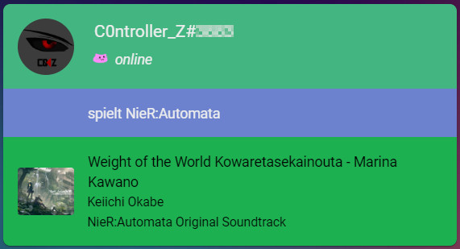

# discord-card
A Lovelace card for the HomeAssistant [Discord Game](https://github.com/LordBoos/discord_game) integration.  
**If you want to use this you have to use [my fork](https://github.com/C0ntroller/discord_game) so custom emotes work!**



## How to install
### Use HACS
- Just add the repo as custom repository
- Hit install

### Manual install
- Follow [this guide](https://github.com/thomasloven/hass-config/wiki/Lovelace-Plugins)
```yaml
resources:
  - type: module
    url: /local/flex-table-card.js
```

## Options
| Name               | Type    | Required | Default | Description                                                          |
|--------------------|---------|----------|---------|----------------------------------------------------------------------|
| entity             | String  | **true** | -       | The discord game entity                                              |
| show_custom_status | Boolean | false    | *true*  | Show a users custom status if it is set                              |
| show_game          | Boolean | false    | *true*  | Show what game a user is playing                                     |
| show_streaming     | Boolean | false    | *true*  | Show info and link when a user is streaming                          |
| show_spotify       | Boolean | false    | *true*  | Show song info when a user is listening to Spotify                   |
| show_misc          | Boolean | false    | *true*  | Show misc activities ("Listening" and "Watching") with info and link |
